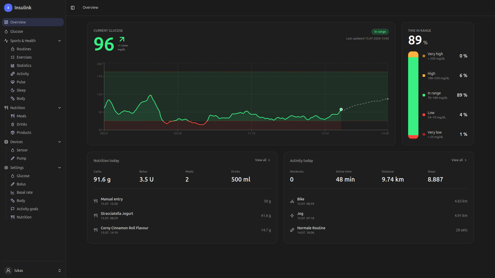

# Insulink Panel

The browser-based companion to the **Insulink** app — a diabetes/CGM tracker.
Users sign in with their app credentials and view and manage their **own** data.
The panel is self-service: there is no admin/multi-user role — every endpoint is
scoped to the caller's own account via JWT.

It speaks the same `/v1` REST API as the mobile app (bearer token,
`{ success: bool }` envelope, refresh on `417`, logout on `403`).



## Features

- **Overview** – current glucose value (colour-coded), time in range, sensor
  time remaining and a history chart.
- **Glucose** – history, statistics (avg / min / max / TIR) and a readings table.
- **Nutrition** – meals, drinks and products.
- **Sports & Health** – workouts, cardio, measurements, health days and pulse.
- **Settings** – glucose unit, target ranges and notifications.
- **Account** – change username and password.

## Tech stack

React 19 · Vite 8 · TypeScript · React Router 7 · TanStack Query + Axios ·
Zustand · Tailwind CSS 4 with shadcn/ui · Recharts · i18next.

## Development

```bash
npm install
npm run dev      # Vite dev server on http://localhost:5173
npm run build    # tsc -b && vite build
npm run preview  # preview the production build locally
npm run lint
```

### Configuration

The API base URL comes from `VITE_API_BASE_URL` (`.env`):

```
VITE_API_BASE_URL=https://insulink.lukasbreuer.de/v1/
```

For a local backend use `http://localhost:8080/v1/` instead.

> **CORS:** login fails in the browser until the panel's origin
> (e.g. `http://localhost:5173`) is allowlisted on the backend in `config.ini`
> under `[web] allowed_origins`.

## Deployment

Ships a `Dockerfile` + `nginx.conf`: nginx serves the build on port **8081** and
proxies `/v1/` to the backend (`CORE_URL`, default `http://localhost:8080`).

```bash
docker build -t insulink-panel .
docker run -p 8081:8081 -e CORE_URL=https://insulink.lukasbreuer.de insulink-panel
```

## Project structure

```
src/
  api/client.ts        Axios wrapper (auth header, token refresh)
  api/services/        one service per domain (glucose, nutrition, sport, …)
  store/user-store.ts  auth/token state (Zustand, persisted in cookies)
  routes/              router + auth guard + lazy page loader
  layouts/panel/       sidebar/header shell (PanelPage)
  pages/panel/         the pages (overview, glucose, nutrition, health, …)
  lib/glucose.ts       glucose classification, colours, units
  global.css           theme tokens (indigo, mirroring the app)
```

Architecture, conventions and the **timestamp gotcha** (glucose in seconds, the
rest in milliseconds) are documented in [CLAUDE.md](./CLAUDE.md).
